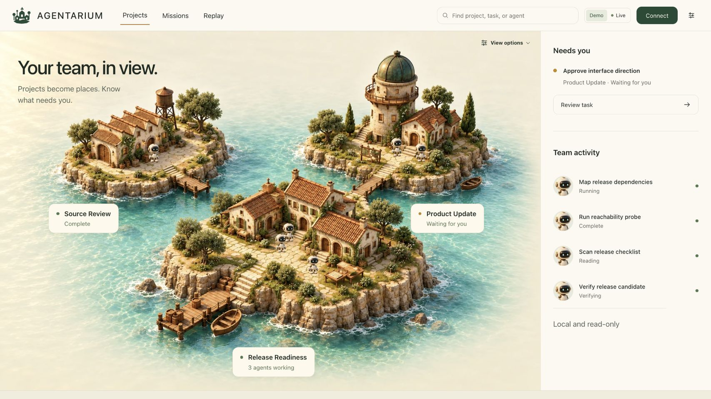

# Agentarium

Agentarium is a localhost-only map of agent work. Projects appear as islands,
their current agent states are visible at overview, and each root task opens
into a larger village with a home, work spot, state, and bounded evidence trail
for every agent.

## Try it locally

With **Node.js 24+** installed, paste this into your terminal:

```bash
npx --yes agentarium-map@latest
```

This downloads the prebuilt app and opens a fictional Demo on your computer.
No Git, cloning, or local build is needed. It does not read your agent history.
Stop it with `Ctrl-C`. See [Run locally](#run-locally) to connect a live source.



[Watch the 36-second demo film](launch/2026-09-redesign/agentarium-launch.mp4).

The app centers three supervision questions:

1. What is moving right now?
2. What is waiting or needs a decision?
3. What evidence supports that status?

The map is the primary interface, and its UI consumes one provider-neutral
`WorldSnapshot` contract. A provider can be a local database adapter, a JSON
file, a JSONL stream, or an injected source that implements the same small
interface. The included Codex adapter is tested against local SQLite state;
the Claude Code and OpenAI Agents SDK examples are normalized contract
fixtures, not native integrations. The tested boundary is listed in
[`docs/provider-matrix.md`](docs/provider-matrix.md). The runtime is localhost-only and
read-only: the browser observes snapshots and never sends prompts, commands,
approvals, or webhooks back to a provider. The complete read-only route
inventory is documented under [Providers and API boundary](#providers-and-api-boundary).

The durable visual and interaction decisions are recorded in
[`DESIGN.md`](DESIGN.md). Product copy, names, controls, and state labels use
a native system sans-serif face with a deliberately small set of
weights. Mono is reserved for commands, bounded identifiers, and compact
evidence metadata.

## What makes it useful

- **Map-first workflow:** start with every project and its current agent-state
  preview, open the Atlas when you need the full project, task, and agent
  hierarchy, then enter one village with room for large homes, moving agents,
  and permanent names.
- **Readable identities:** task titles stay separate from agent nicknames, roles,
  and assignments. An opaque identifier is used only when the source has no
  usable label.
- **Evidence Lens:** turn on the signature spatial view to see the evidence
  for the current state of one selected agent. The selected agent and its
  root task agent remain emphasized, unrelated villagers dim, and the proof card
  reports Observed, Derived, or Unknown evidence without exposing payloads.
- **Mission Board:** every root task is one mission with a human-readable name,
  project, phase, agent counts, bounded evidence, and one path back to its task
  map. The board shows **Your move** only for an explicit bounded needs-you or
  approval signal. A generic agent wait is not presented as a request for the
  owner.
- **Agent attention filter:** narrow the map to current provider attention,
  including waits, human gates, and provider-reported root failures. This is an
  agent view filter, not a second mission ledger. Historical child failures,
  interruptions, stale records, and unknown states remain visible in their
  task views, but the filter does not include them as current attention items.
- **Evidence replay:** move through the bounded event window without sending
  anything to the source.
- **Diagnostic inspector:** inspect the model, reasoning effort, token total,
  branch, child count, current action, and redacted event trail.
- **Safe failure:** an unavailable or invalid source becomes an explicit empty
  live view. Demo mode remains available as a deterministic synthetic scene.

## Reading the world

Before any panel is opened, the map shows the following bounded state:

1. The overview is the first map: it shows the exact project, task, and agent
   scope, plus a state-derived preview of agents on each project island. Open
   a project, then open a named task to follow its complete village.
2. Open **Atlas** for a keyboard-reachable hierarchy of every project, task,
   and agent. The drawer is utility navigation, not a replacement for the
   map. Roster reachability and focus retention are covered in
   [`src/components/Archipelago.test.tsx`](src/components/Archipelago.test.tsx).
3. Use the **Missions** launcher in the world command bar to review every root
   task. Each row states its phase, agent summary, latest bounded evidence, and
   the next human decision when one is explicitly requested. The **Agent
   attention** toolbar filter can narrow the map to current provider attention;
   it does not replace the board.
4. Open **Replay** beside Missions to move the bounded event cutoff without
   changing the source. A verified root completion and its world change appear
   only when the completion is at or before that cutoff, and rewinding removes
   the change again. While Replay is open, incoming live snapshots are buffered
   instead of changing the displayed world. **Return to live** applies the
   newest buffered snapshot in one step. The refresh-freeze and single-step
   return are covered in [`src/App.test.tsx`](src/App.test.tsx).
5. Select a villager for a slim in-map card. Open its secondary **Inspector**
   only when you need the model, counts, redacted event trail, or other
   bounded detail.

## Evidence Lens

Evidence Lens answers one narrow question: **Evidence for current state**. It
does not claim a root cause or infer a causal story. At the current replay
position, the latest eligible event is selected deterministically. Its
strength is shown as Observed or Derived. When no eligible event exists, the
answer is Unknown. The selector and its boundary cases live in
[`src/lib/evidence.ts`](src/lib/evidence.ts) and
[`src/lib/evidence.test.ts`](src/lib/evidence.test.ts).

The lens is intentionally privacy-safe. The proof card shows a bounded event
label, the number of eligible events, and `Payloads withheld`. It never shows
transcript text, message bodies, command text, tool results, paths, or raw
event payloads. Future events cannot appear before the replay cutoff.

The Evidence Lens places that bounded provenance card directly on the task map.
It reports only what the normalized snapshot supports.

## Mission Board

The Mission Board is the mission-level supervision surface. It builds one
mission for each root task in the complete normalized snapshot, keyed by the
project and root-task IDs. Search and the Agent attention filter may hide agents
from the map, but they do not remove a mission, rename its root task, or change
its evidence-derived state.

Each mission has a current phase and a five-step trail: Planning, Working,
Verification, Waiting for you, and Complete. The model also keeps neutral or
exceptional states such as Waiting on agent, Failed, Interrupted, Stale, and
Unknown. These states are not silently converted into progress. **Your move**
appears only when the bounded current evidence contains an explicit needs-you
or in-progress approval signal. Its row includes the bounded reason and latest
event label, followed by a read-only action to review the task in the map.

A task receives a verified-completion marker only after an observed root-task
completion. A child completion, derived signal, unknown state, or completion
after the replay cutoff does not qualify. Rewinding removes the marker when
the completion falls after the cutoff. The landscape and project positions
remain stable. These markers are recomputed from the current snapshot and
replay position, not stored as game progress. The cutoff projection is
covered in [`src/lib/missions.test.ts`](src/lib/missions.test.ts) and
[`src/components/Archipelago.test.tsx`](src/components/Archipelago.test.tsx).

The daily summary reports completions, explicit intervention signals,
recoveries, and regressions for a stated time-zone window. An intervention
signal records a bounded approval or needs-you request; it does not claim that
a person acted. The summary is marked as based on bounded recorded evidence
because a provider may retain only a recent event window. It is read-only, not
a score or an estimate of unseen history. Time-zone windows, deduplication,
recoveries, and regressions are covered in
[`src/lib/missions.test.ts`](src/lib/missions.test.ts).

## Run locally

Agentarium requires Node.js 24 or newer. Start the prebuilt npm package:

```bash
npx --yes agentarium-map@latest
```

The launcher starts the server on `127.0.0.1` and opens the local app.
Stop it with `Ctrl-C`.

Demo never inspects Codex or another harness. A live provider is always an
explicit startup choice. The server ignores a generic `HOST` setting and never
binds to a LAN interface; that boundary is covered in
[`tests/server-index.test.mjs`](tests/server-index.test.mjs).

Use **Connect** in the toolbar to copy the adapter commands from the
app.

### Connect Codex

The included Codex adapter reads the tested local SQLite state and does not
write to it:

```bash
npx --yes agentarium-map@latest --provider codex
```

When the browser opens, choose **Live**. The source label and agent count
confirm which adapter is active.

### Connect another harness

Agentarium connects to a harness through a small read-only bridge that writes
the provider-neutral `WorldSnapshot` contract as JSON or JSONL. It does not
inspect arbitrary harness internals, so each harness needs either the built-in
Codex adapter or a bridge that produces the documented snapshot shape.

For another harness, have a small bridge write one complete JSON snapshot or an
append-oriented JSONL file. Validate the file, start the matching provider, and
then choose **Live**:

```bash
npx --yes agentarium-map@latest --validate /path/to/world.json
npx --yes agentarium-map@latest --provider json --snapshot /path/to/world.json
```

```bash
npx --yes agentarium-map@latest --validate /path/to/world.jsonl
npx --yes agentarium-map@latest --provider jsonl --snapshot /path/to/world.jsonl
```

The bridge requirement, versioned fields, and tested examples are in the
[`WorldSnapshot schema`](docs/world-snapshot.schema.json),
[`provider-neutral example`](docs/world-snapshot.example.json), and
[`provider and harness matrix`](docs/provider-matrix.md). Validate a producer
file before connecting it with the launcher or
[`server/validate-snapshot.mjs`](server/validate-snapshot.mjs).

This is a provider-neutral contract, not a claim that Agentarium can discover
every harness automatically. Codex is the tested native adapter. Other
harnesses need a bridge that emits the documented shape.

### Run from a source checkout

For development, clone and build the source:

```bash
git clone https://github.com/bIackr0se/agentarium.git
cd agentarium
npm ci
npm run agentarium -- --provider demo
```

Use `npm run dev` instead when actively editing the React interface. For a
production build from source:

```bash
npm run build
npm start
```

## Harness-independent snapshots

The canonical contract is documented in
[`docs/world-snapshot.schema.json`](docs/world-snapshot.schema.json), with a
small provider-neutral example in
[`docs/world-snapshot.example.json`](docs/world-snapshot.example.json).

Validate a producer file using the same bounded server projection used at the
API boundary:

```bash
npx --yes agentarium-map@latest --validate /path/to/world.json
npx --yes agentarium-map@latest --validate /path/to/world.jsonl
```

From a source checkout, the equivalent command is
`npm run validate:snapshot -- <path>`.

The validator accepts one JSON snapshot or a JSONL file containing one snapshot
per line. JSONL records are checked independently, and malformed JSON or
contract-invalid records make strict validation fail. The runtime JSONL adapter
is deliberately more tolerant of an interrupted append: it keeps the last
complete valid record when a newer line is malformed or incomplete, and adds a
bounded warning. [`tests/data-source.test.mjs`](tests/data-source.test.mjs)
carries the malformed-tail and recovery probes. Provider selection happens
once at startup and is never controlled by browser query parameters. File
sources are read-only, bounded, projected through the allowlist contract, and
fail closed to an empty live view when no valid record is available.

The Codex adapter is read-only and requires a Node.js release that provides the
built-in `node:sqlite` module. Without the explicit setting shown above,
startup never imports the adapter or touches Codex-local database paths.

### Required contract shape

The producer supplies a versioned `WorldSnapshot` with these concepts:

- `schemaVersion: 1`, `mode`, `generatedAt`, and `sourceFreshness` identify the
  snapshot. `sourceLabel` is an optional bounded label shown as provenance in
  the map.
- `projects` contain `id`, `name`, `color`, `agentIds`, `activeCount`, and
  `attentionCount`.
- `agents` contain an `id`, task `title`, project identity, lifecycle `state`,
  `evidence`, timestamps, `currentAction`, `childCount`, and an `events` list.
  `nickname`, `role`, `assignment`, model metadata, branch, and
  `parentAgentId` are optional. `parentAgentId` links execution units for the
  task-village hierarchy without assuming a particular harness.
- Events use `agentId`, `timestamp`, a bounded `kind` and `label`, lifecycle
  state, generic provider `source`, evidence strength, and optional status or
  duration. `source` is provenance text, not a fixed provider name.
- `privacy.rawContentExposed` must be `false`. `redactionsApplied` records
  source-side or boundary-side redactions. `warnings` is optional bounded
  diagnostic text.

Unknown producer fields are discarded by the server projection. Labels,
identifiers, timestamps, states, events, and counts are bounded before they
reach the browser. The schema and example are the integration reference, not a
requirement to copy any provider's internal database model.

See [`docs/provider-matrix.md`](docs/provider-matrix.md) for the tested
adapter-versus-contract boundary. Named non-Codex rows there are synthetic
normalized exports, not native integrations.

## Providers and API boundary

`server/data-source.mjs` selects one startup-configured provider and exposes the
same read-only interface for each source: `getSnapshot`, `getEvents`,
`diagnostics`, and `close`.

The JSON and JSONL adapters are the provider-neutral path. No provider is
selected when the server starts without configuration, so its Live source is
an explicit empty state. An optional local SQLite adapter is available as one
adapter for environments that expose the matching lifecycle tables. It is
loaded only when `AGENTARIUM_PROVIDER=codex` (or an explicit Codex provider
option) is selected. The product identity, browser contract, hierarchy, and UI
do not depend on that adapter.

The HTTP surface is read-only and loopback-only:

- `GET /api/snapshot` and `GET /api/world` return the current live snapshot.
- `GET /api/snapshot?mode=demo` and `GET /api/demo` return synthetic demo data.
- `GET /api/events?mode=live` provides bounded server-sent snapshot updates.
- `GET /api/agents/:agentId/events` returns the bounded event trail for one
  agent. The legacy `/api/threads/:agentId/events` path remains accepted for
  compatibility.
- `GET /api/health` reports source readiness without exposing configured file
  paths.

No endpoint sends prompts, approvals, commands, or control messages to a
provider.

## Mission Board, Agent attention filter, and historical outcomes

The Mission Board separates mission-level state from the agent-level Agent
attention filter and from recorded outcomes:

| Surface | States or signal | Meaning in the UI |
| --- | --- | --- |
| Mission Board | One row per root task | Shows the mission phase, all member counts, bounded evidence, explicit human decisions, and evidence-linked world evolution. |
| Agent attention filter | `waiting`, `needs-you`, `failed` | Narrows the map to current provider attention. The local adapter promotes waits, human gates, and failed root runs. |
| Working | `thinking`, `reading`, `editing`, `running`, `delegating`, `verifying` | The agent has recent evidence of active work and moves in its village. |
| Recorded outcome | `complete`, `interrupted`, `stale`, `idle`, `unknown` | The state remains visible for context. It does not automatically become a live human request. |

An interrupted turn is an observed lifecycle outcome, not proof that an agent
is currently waiting. A failed child operation can remain visible under a
healthy root task without creating a duplicate global alert. A generic
`waiting` state means the agent is waiting on another agent unless the bounded
evidence contains an explicit human gate. `unknown` means the available
evidence does not support a more specific state.

## Privacy boundary

The browser may receive bounded task metadata such as task titles, project
names, opaque IDs, provider labels, model and effort labels, token totals,
branch names, timestamps, lifecycle classifications, and redacted event
labels.

The browser contract omits transcript bodies, user or agent messages, command
text or output, tool arguments or results, and working directories. Its label
sanitizer redacts recognized absolute paths, email addresses, internal IP
addresses, and secret patterns before rendering. Every JSON response is
checked at the HTTP boundary. Treat task titles and other source metadata as
untrusted display data. The allowlist is the
[`WorldSnapshot` schema](docs/world-snapshot.schema.json); the planted-secret,
path, email, IPv4/IPv6, and API-boundary probes live in
[`tests/observer.test.mjs`](tests/observer.test.mjs) and
[`tests/provider-matrix.test.mjs`](tests/provider-matrix.test.mjs).

Loopback limits network exposure; it is not authentication or multi-user
isolation. A local process or user that can reach the server can read the same
bounded metadata. The sanitizer catches the documented path, address, and
secret shapes, but it is not a general data-loss-prevention system.

Use Demo mode for screenshots or public examples. Demo records are synthetic,
contain no connected-source data, and do not select or query a live provider.

## Architecture

```text
normalized JSON/JSONL source ─┐
optional local database adapter ─┴─> data-source -> allowlist projection -> privacy assertion
                                      |
                                      v
                          snapshot cache, JSON API, SSE
                                      |
                                      v
                                localhost React app
                                      |
                  project map -> task villages -> individual agents
                                      |
                  Mission Board, inspector, and evidence replay
```

The hierarchy is pure over the normalized snapshot. Every visible agent belongs
to one project and one root-task group, including children whose parent is
outside the bounded snapshot. The partition and missing-parent cases are
covered in [`src/lib/hierarchy.test.ts`](src/lib/hierarchy.test.ts). Names and
navigation controls are rendered as DOM text and controls, separate from
decorative art.

## Verification

Install the browser runtime once, then run the verification gate:

```bash
npx playwright install chromium
npm run verify
```

The [`verify` script](package.json) runs TypeScript checks, Node
observer/classifier/privacy/API tests, UI interaction tests, a production
build, package installation, and Chromium checks at five widths from 320 to
1440 pixels. Browser checks cover rendered text contrast, hover and focus
states, layout, navigation fades, reduced motion, live updates, and the shared
header/favicon asset. Screenshots and contrast results are saved under
`output/playwright`; CI retains them for seven days. These checks do not replace
visual review or a full accessibility audit. Useful focused checks are:

```bash
npm run lint
npm run test:node
npm run test:ui
npm run test:install
npm run test:browser
npm run validate:snapshot -- docs/world-snapshot.example.json
npm run build
```

Manual browser verification should exercise Live and Demo switching, project
and task navigation, Mission Board rows, Agent attention filtering, inspector
selection, replay reset, keyboard navigation, and desktop/mobile widths. Verify that the
public capture is in Demo mode and that no source-derived label or path is
visible. In Demo, confirm that the Mission Board includes the completed-root
showcase and that rewinding Replay removes its verified-completion marker.

## Main files

- `server/data-source.mjs`: startup provider selection and common read-only
  source interface, including injected-source validation
- `server/snapshot-source.mjs`: JSON and JSONL snapshot adapter
- `server/snapshot-contract.mjs`: bounded allowlist projection and fail-closed
  contract validation
- `server/observer.mjs`: optional local SQLite adapter
- `server/classifier.mjs`: evidence-aware lifecycle classification
- `server/privacy.mjs`: redaction and output-boundary assertions
- `server/api.mjs`: localhost JSON and event-stream API
- `server/validate-snapshot.mjs`: producer-file validator
- `src/App.tsx`: source handling, search, filters, replay, and keyboard
  navigation
- `src/lib/evidence.ts`: deterministic, bounded Evidence Lens selection
- `src/lib/hierarchy.ts`: project, root-task, and agent hierarchy
- `src/lib/missions.ts`: replay-bounded mission phases, human gates, daily
  summaries, and evidence-linked world evolution
- `src/components/MissionBoard.tsx`: the root-task supervision ledger and
  explicit human-decision path
- `src/components/Archipelago.tsx`: overview, project map, and full-size task
  village
- `src/components/WorldArt.tsx`: shared environment crops and robot artwork
- `src/lib/island-routes.ts`: courtyard paths and crop coordinates
- `docs/world-snapshot.schema.json`: versioned producer contract
- `docs/world-snapshot.example.json`: minimal provider-neutral example
- `docs/provider-matrix.md`: tested adapter and normalized-contract coverage
- `DESIGN.md`: durable map-first visual and interaction contract

The sculpted artwork and retained legacy asset notices are documented in
[`docs/visual-assets.md`](docs/visual-assets.md).

## License

Agentarium code is available under the [MIT License](LICENSE). Artwork provenance,
font licensing, and retained CC0 asset notices are listed in
[`docs/visual-assets.md`](docs/visual-assets.md).
